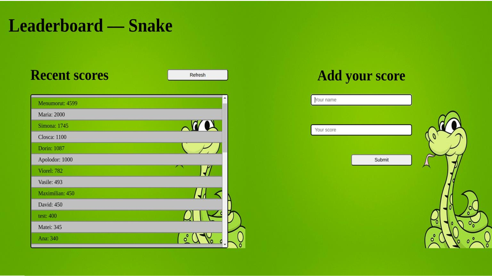

# Leaderboard

> The leaderboard website displays scores submitted by different players. It also allows you to submit your score.

All data is preserved thanks to the external Leaderboard API service.

## Built With

- Major languages: HTML & CSS along with JavaScript
- Frameworks: Vanilla JavaScript;
- Technologies used: Webpack, GitFlow, GitHub

## Live Demo

[Live Demo Link](https://leaderboard-snake-game.netlify.app/)

## Getting Started

### Setup

To get a local copy up and running follow these simple steps.

To setup the Leaderboard project in your local, in the repo page:
click on code (dropdown list) > Download as ZIP.
or open terminal of path you want to install project and run this command  
`git clone git@github.com:nicupop729/Leaderboard.git`

### Install

Run in your terminal the following commands:

**`$ cd Leaderboard/`**
**`$ npm install`**
**`$ npm run build`**
**`$ npm start`**

## Author

👤 **Nicolae Pop**

- GitHub: [@nicupop729](https://github.com/nicupop729)
- Twitter: [@nicupop729](https://twitter.com/nicupop729)
- LinkedIn: [LinkedIn](https://www.linkedin.com/in/nicolae-pop/)

## 🤝 Contributing

Contributions, issues, and feature requests are welcome!

Feel free to check the [issues page](https://github.com/nicupop729/Leaderboard/issues).

## Show your support

Give a ⭐️ if you like this project!

## Acknowledgments

This is a project done during the Microverse course using their support and frameworks provided.

## 📝 License

This project is [MIT](./MIT.md) licensed.
